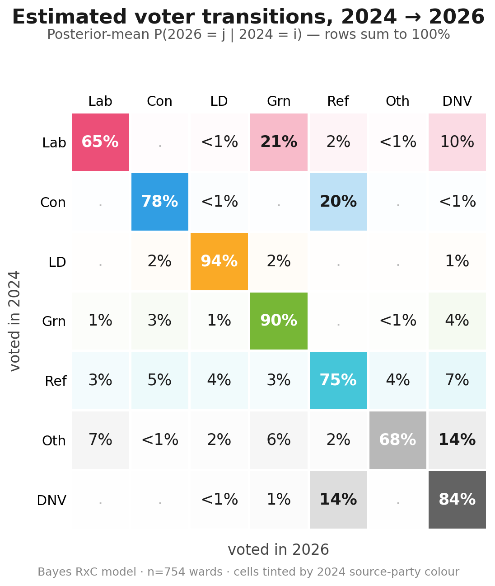
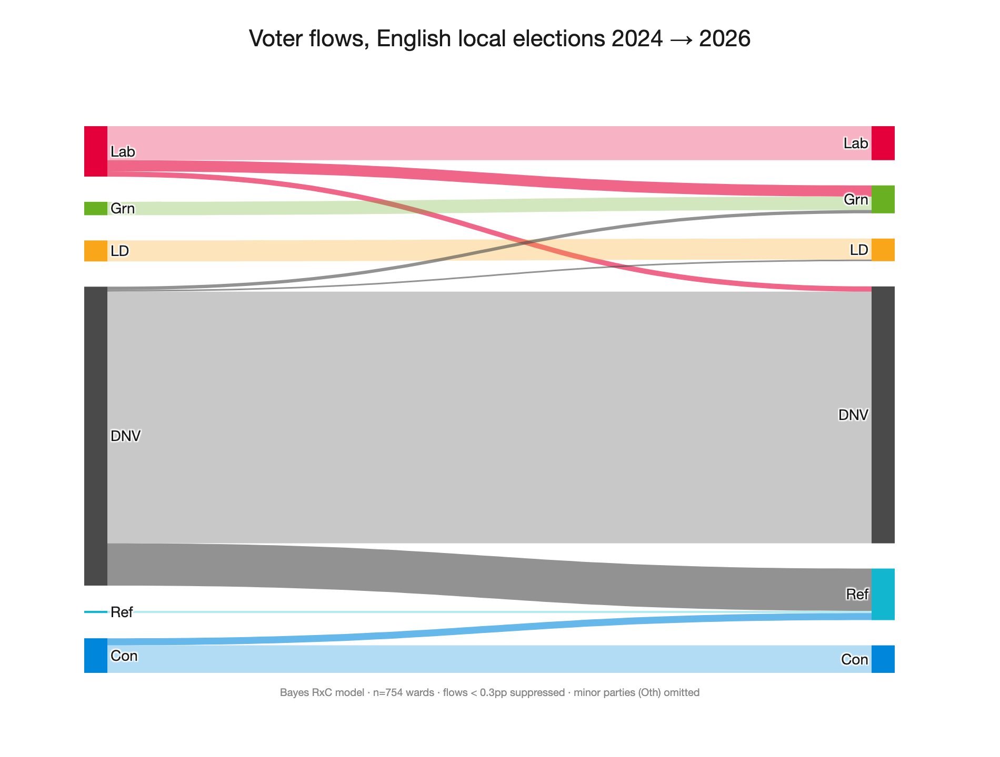
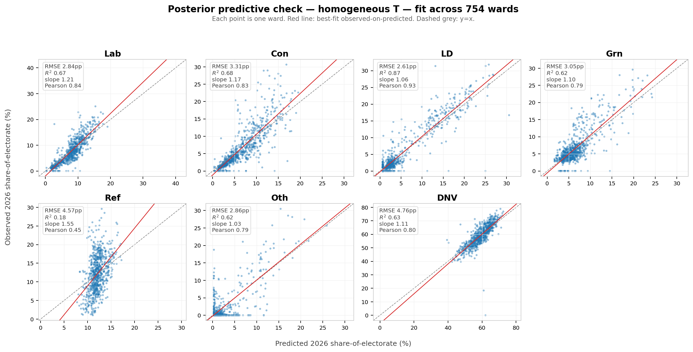
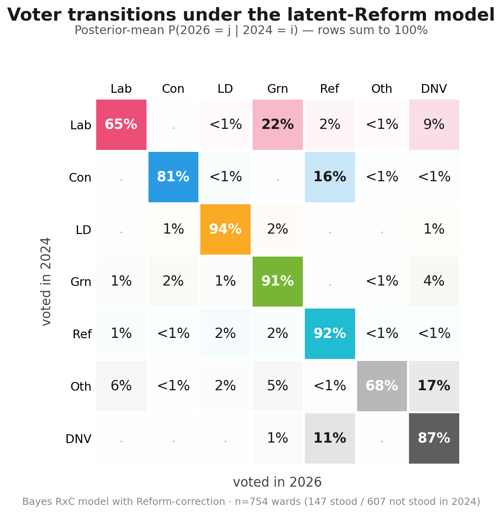
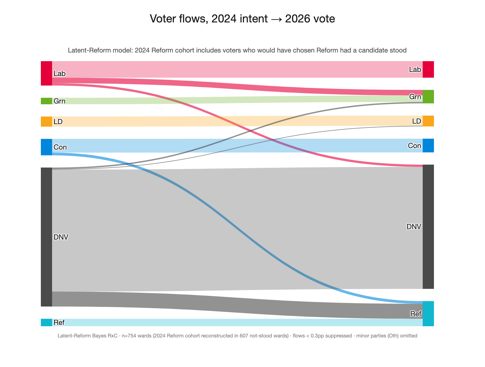
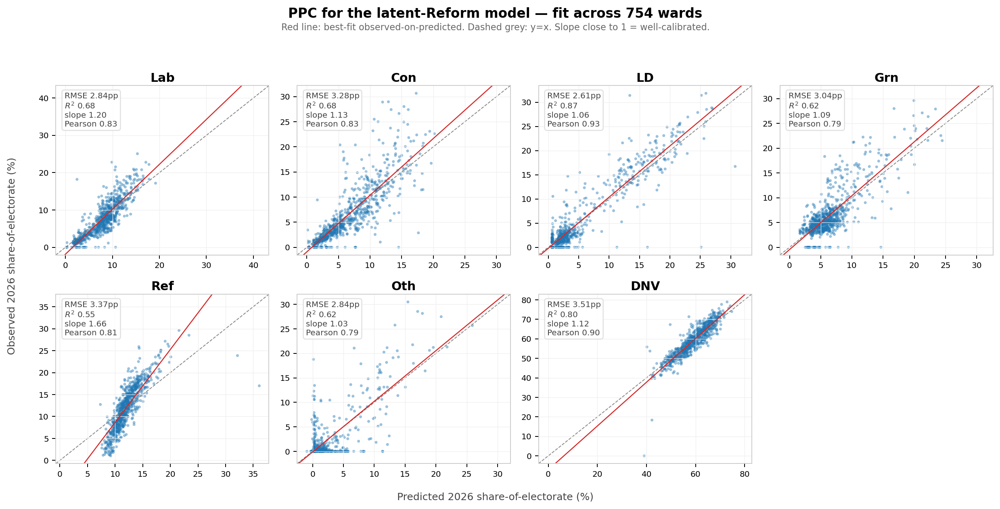

# Context

I recently [posted a visualisation](https://bsky.app/profile/oskanberg.bsky.social/post/3mljoawmkcs2n) from some exploratory modelling - on the effect of turnout on shifts in vote share - that I had attempted. I got some interest on that post, so this document aims to explain the modelling in more detail. Hopefully there is enough high level information for a casual reader, and enough detail for those who want to dig deeper. 

The data and code are available [here](https://github.com/oskanberg/2026-voter-flows).

The visualisation I shared was from the 'baseline' model shared below, and I've included an extension to the model that attempts to account for some innacuracies in the baseline.

I have tried to call out places where this modelling makes assumptions and simplifications, but please also bear in mind that I am not a political scientist and this is not my area of expertise. And note that the plots/results here differ slightly from the original post, due to the inclusion of more ward data.

As always, if you have comments or questions, please get in touch on [Bluesky](https://bsky.app/profile/oskanberg.bsky.social) or via [email](mailto:oliverskanbergtippen@gmail.com).

# Estimating voter flows in the 2026 English local election

It is common to hear pundits refer to a 'swing' of voters from one party to another. In reality, the change in voting behaviour is more nuanced: even if the aggregate figures show a 'swing' from Lab->Ref in a particular ward, a closer examination might reveal a more complex (but more interesting) simultaneous movement of votes Lab -> Grn and DNV->Ref.

It is not helpful that results are not reported and discussed with DNV count estimates as standard. This means that the largest cohort of voters in the UK (those that did not vote) are invisible in the debate.

But even when DNV counts are included in the post-election discussion, key information is still missing: we do not know how individual voters changed their votes since the last election. The aim of this modelling is to try to glean some information about those transitions from the aggregate data.

## Baseline model

In practice, it is not possible to discern ward-by-ward how people changed their votes without more detailed data. We don't have the voting histories of the electorate, and as yet don't have much post-election polling data. The data we *do* have are the expressed preferences in ward-level aggregates: total number of people voted for each party in different years, and an estimate of what % turnout that represents.

The challenge is to recover the individual transitions (who switched from what to what) from these aggregate tallies. Of course, we will only be able to *estimate* those transitions (and even so, only under many assumptions). Deriving that estimate is an established problem called '[ecological inference](https://www.sciencedirect.com/topics/social-sciences/ecological-inference)'.

Let's naively assume that there is one national probability 'transition matrix' that describes, for any given voter, the probability of their choice in 2026 based on their choice in 2024 ('choice' here includes DNV). Formally, each cell of the matrix is a conditional probability:

$$T_{ij} = P(\text{2026 vote} = j \mid \text{2024 vote} = i)$$

> [!NOTE]
> Assumption: homogeneity. This assumes the same transition matrix applies to every ward. In reality, this is obviously not the case. The classical ecological-inference literature ([King 1997](https://gking.harvard.edu/eicamera/kinroot.html); [Rosen et al. 2001](https://gking.harvard.edu/files/abs/rosen-abs.shtml)) relaxes this with per-ward transition matrices drawn from a 'shared hyperprior'. I have not done that here.

Each row of $T$ is a probability distribution over the 7 categories (Lab, Con, LD, Grn, Ref, Other, DNV). It sums to 1, since every 2024 voter must end up *somewhere* in 2026 (even if that "somewhere" is DNV again).

> [!NOTE]
> Assumption: aggregating minor parties. Lumping everything else into an "Other" bucket is a simplification. Lab/Co-op is also merged into Labour.

 At the ward level, if $x_w$ is the vector of 2024 cohort shares and $y_w$ is the vector of 2026 shares, the model predicts:

$$y_w \approx T \cdot x_w$$

With the vote count from just one ward, the task of estimating $T$ is 'underspecified'. That is, it is fundamentally ambiguous whether the votes moved directly from one party to another, or whether instead they transferred to/from a third or fourth option.

If we add more ward data, however, we can build a problem that is solvable. Again, assuming that the basic transition matrix is consistent everywhere, across $N$ wards we want a single $T$ that makes $y_w \approx T \cdot x_w$ hold as closely as possible for every $w$. 

$T$ has 7 rows and each row is a 7-way probability distribution. That translates to 6 'free parameters' per row, since the row must sum to 1. That means there are effectively 42 unknowns in $T$.

Each ward gives us 6 effective constraints on $T$. We have hundreds of wards to work with, which means that on paper we have enough information to solve for $T$, provided the wards differ enough in their political composition.

### Bayesian priors

Instead of picking a single "best" $T$, we can compute a probability distribution over plausible solutions, and report the mean (plus credible intervals).

The model is set up as follows. Each row of $T$ is a probability distribution over the 7 categories. We give each row a Dirichlet prior (a distribution over probability distributions). For row $i$:

$$T_i \sim \text{Dirichlet}(\alpha_i)$$

where $\alpha_i$ is a 7-vector whose entries control the mean and concentration of the prior (the details are spelled out in the two subsections below).

Each ward gives us one observation. The model assumes the observed 2026 vector $y_w$ is the predicted vector $T \cdot x_w$ plus some Gaussian noise:

$$y_w \sim \text{Normal}(T \cdot x_w,\ \sigma_{\text{obs}})$$

where the noise has half-normal prior:

$$\sigma_{\text{obs}} \sim \text{HalfNormal}(0.1)$$

And that's it! 

Putting the data and priors together via Bayes' rule gives a joint posterior over $T$ and the noise parameter $\sigma_{\text{obs}}$. It samples from that posterior using PyMC's NUTS sampler, then reports posterior means and credible intervals.

Before inferring probable values of $T$, we need to specify *prior beliefs* about $T$ (via $\alpha$): what should the model use as its default beliefs before seeing any data. The model adds priors for two types of behaviour:

1. Retention rates: how likely a voter is to stay loyal to their chosen party between elections. The model uses a mean of 70% for each row, including DNV (effective prior sample size of ~35 voters per row). This is based on [Mellon (2021)](https://papers.ssrn.com/sol3/papers.cfm?abstract_id=3957460) and [Fieldhouse et al. (2020)](https://library.oapen.org/handle/20.500.12657/47106) which imply typical retention rates of 65–80%.

2. How likely a previous voter is to switch to abstaining. This source at the [House of Commons Library](https://commonslibrary.parliament.uk/general-election-2024-turnout/) suggests a net decline of 7.6 percentage points in the 2024 election. The gross drop-out rate must be larger than this. A range of 5–10% gross value seems reasonable, so the model uses a prior mean of ~8.5% for each party -> DNV cell.

> [!NOTE]  
> With hundreds of wards to fit on, the data is much 'stronger' than these priors. So where the data has clear signal, the posterior probabilities should be data-driven rather than rely on these priors. However, the prior matters for characteristics that we can't identify cleanly, especially for rows of $T$ that have very little data to work with.

> [!NOTE]
> The net and gross flows to and from DNV are indistinguishable from aggregate data. I suspect that the model under-predicts shifts to and from DNV, despite the priors above.

> [!NOTE]
> Wards are not size-weighted. A 200-voter ward and a 4,000-voter ward contribute equally to the loss. If small and large wards behave systematically differently, this biases toward the smaller-ward pattern.

## Data

I used [Democracy Club's](https://democracyclub.org.uk/) published ward-level candidate results for the May 2024 and May 2026 elections. In order to keep the analysis simple, I filtered to wards that were reasonably comparable across the two years.

> [!NOTE]
> Local elections are not held in all wards every year. This means that comparing 2024 and 2026 selects only a subset of wards.

The analysis includes only wards that:

- had a contested election in both years (so we can compare)
- weren't by-elections in either year (for the avoidance of idiosyncratic dynamics)
- reported turnout in both years (we need this to handle abstention)

After filtering, there are 754 wards to work with.

> [!NOTE]
> I did a sanity check of the filtered list of wards, and none were obviously affected by boundary changes between 2024 and 2026.

I preprocessed parties into seven categories: Labour, Conservative, Liberal Democrat, Green, Reform, "Other" (all minor parties), and DNV. DNV is inferred from reported turnout. Labour and Co-operative Party are merged into Labour.

#### Multi-member wards

Some wards have multiple seats up for election. In these wards, each voter casts multiple votes. This means that the raw vote totals are probably overstated for parties that fielded full slates relative to those that didn't.

To convert ballot marks to vote shares, each party's votes are divided by the number of candidates that party fielded in that ward. This assumes a party's supporters cast their full slate for that party, which is of course also an oversimplification.

## Baseline results

The figure below shows the posterior means of the estimation described above. Reading row-wise: of every 100 voters in cohort X in 2024, this many voted for each option in 2026. 

As a Sankey diagram:

### Fitness check

How well does the model actually fit the 754 wards?
We can compare the observed 2026 vote shares to the predicted 2026 vote shares from the model:

| Cell | RMSE  | R²       | Mean bias |
| ---- | ----- | -------- | --------- |
| Lab  | 2.8pp | 0.68     | -0.2pp    |
| Con  | 3.3pp | 0.68     | +0.0pp    |
| LD   | 2.6pp | 0.87     | +0.1pp    |
| Grn  | 3.1pp | 0.62     | +0.1pp    |
| Ref  | 4.6pp | **0.18** | +0.1pp    |
| Oth  | 2.9pp | 0.62     | -0.1pp    |
| DNV  | 4.8pp | 0.63     | +0.1pp    |

And visually, predicted vs observed 2026 share for each ward and category:

In aggregate, it appears to fit the data fairly well, but Reform 2026 column is the clear exception (note R² 0.18). Visually, the model clearly under-predicts the 'slope' of the Reform share.

## Is DNV → Reform really 14%?

Reform appears to be disproportionately the beneficiary of mobilised non-voters. This baseline model estimates ~14% of 2024 abstainers turning out for Reform in 2026. This seems suspicious, especially combined with the model underperformance for Reform in the fitness checks above.

I suspect that the model is under-predicting gross flows away from parties in general, and as a result over-predicts Reform's share of 2024 DNVers to explain their performance.

That said, I did find [BESIP results](https://politicscentre.nuffield.ox.ac.uk/news-and-events/news/can-labour-take-reform-uks-voters-why-labours-electoral-challenges-are-being-misunderstood/) that found, ~12 months after the 2024 GE, 17.5% of 2024 non-voters reported Reform as their party of choice.

One confounding factor that might cause the poor model accuracy for Reform is the availability of Reform candidates. Reform stood in only 147 of the 754 wards in 2024 but in essentially all 754 in 2026. Voters who *would have* chosen Reform in 2024 had no Reform candidate, so they appear in the data as something else. The model cannot adapt to this effect, since it implicitly assumes that all candidates are available in both years.

To explore this 'candidate availability' effect, I split the 754 wards into two subsets: wards where Reform stood in 2024 (n=147) and wards where they didn't (n=607). I then refit the model separately on each subset:

| Cell            | Candidate available 2024 (n=147) | No candidate 2024 (n=607) |
|-----------------|----------------------------------|---------------------------|
| DNV → Reform    | 13%                              | 14%                       |
| Con → Reform    |  3%                              | 14%                       |

(other rows not significantly changed)

The shift from DNV to Reform barely moves between the subsets (~1pp). Interestingly, flows from Con to Reform vary by nearly an order of magnitude.

At face value (assuming it is not just a model artifact) this suggests that:
- Conservatives lost significantly more to Reform in seats that had previously been uncontested.
- A similar proportion of DNVs turned out for Reform, regardless of whether there was previously a candidate in that seat.

## A model extension: explicitly modelling Reform's missing 2024 cohort

> Code in [model_latent.py](model_latent.py).

In the 607 wards where Reform didn't stand in 2024, the input vector $x_w$ has zero in the Reform slot, by definition.

$$x_w[\text{Ref}] = 0$$

So the model has no way to predict the 2026 Reform vote in those wards from the 2024 Reform cohort. It has to 'spread' the implied vote flows to Reform across other 2024 categories, and do so in a way that minimises the error across all wards - regardless of whether it had a Reform candidate stand in 2024.

The data suggest that 'would-be' Reform voters did *something else* in 2024, that looks meaningfully different from wards where a candidate did stand, but the model is not able to learn the distinction.

One improvement I tried is to give the model two extra sets of parameters to learn:

1. How many of these "hidden Reform" voters were there in each of the wards without 2024 Reform candidates. Call that share $λ_w$. i.e. what fraction of the electorate in this ward would have voted Reform in 2024 if they'd had the chance? This prior was modeled as a HalfNormal(σ=0.05).
2. Where those voters showed up in the observed 2024 data. For simplicity, this is modelled as a uniform distribution $σ$ over the 6 non-Reform categories (embedded as a 7-vector with zero in the Reform slot for the equation below) that represents a single shared answer across all wards without Reform candidates. Prior: uniform Dirichlet(1,...,1).

The new model is then exactly the same as the baseline, except that we replace $x_w$ with $x_w^{*}$:

$$x_w^{*} = x_w + λ_w  (e_{\text{Ref}} - σ)$$

where $e_{\text{Ref}}$ is the unit vector pointing at the Reform slot. $λ_w = 0$ for the 147 wards where there _were_ Reform candidates in 2024. In total, the extension adds 607 ward-level $λ_w$ parameters and the 6-dimensional $σ$.

## Latent model results

This result is more explicitly a model of voting _intent_, and so is less literally accurate to absolute numbers. But it gives a more realistic intention-to-intention flow, boosting the Reform 2024 _implied_ share.

Comparison with the earlier model (posterior means with 80% credible intervals in brackets):

| Cell          | Baseline (model.py)       | Latent (model_latent.py)  | Δ (means) |
| ------------- | ------------------------- | ------------------------- | --------- |
| Lab → Lab     | 65% [63, 66]              | 65% [64, 66]              | 0         |
| Lab → Grn     | 21% [19, 24]              | 22% [20, 24]              | +1        |
| Lab → DNV     | 10% [8, 12]               | 9% [7, 11]                | -1        |
| Con → Con     | 78% [76, 79]              | 81% [79, 82]              | +3        |
| **Con → Ref** | **20% [18, 22]**          | **16% [14, 18]**          | **-4**    |
| **Ref → Ref** | **75% [69, 82]**          | **92% [89, 95]**          | **+17**   |
| **DNV → Ref** | **14% [14, 14]**          | **11% [10, 11]**          | **-3**    |
| DNV → DNV     | 84% [83, 84]              | 87% [87, 88]              | +3        |

DNV -> Ref drops 3pp, Con -> Ref drops 4pp, Ref -> Ref jumps 17pp. In reality this share is small in the absolute numbers, but including the inferred 'would-be' Reform voters increases the implied share. 

### Implied 'Latent Reform' behaviour

The model estimates the following distribution for the 6 non-Reform categories that 'latent Reform' voters substituted to:

| Slot         | σ posterior mean | 80% CI       |
| ------------ | ---------------- | ------------ |
| **DNV**      | **87%**          | **[82, 92]** |
| Other        | 7%               | [2, 12]      |
| Conservative | 3%               | [1, 6]       |
| Labour       | 1%               | [0, 3]       |
| Green        | 1%               | [0, 2]       |
| Lib Dem      | 1%               | [0, 2]       |

This solution suggests that 'latent Reform' voters in 2024 mostly did not vote, rather than substituting to a different party.

### Does the fit improve?

This plot compares the model's 2026 predictions to the observed data, for each ward.

Per-category R²:

| Cell    | Baseline model | Latent model   | Δ         |
| ------- | -------- | -------- | --------- |
| Lab     | 0.68     | 0.68     | 0         |
| Con     | 0.68     | 0.69     | +0.01     |
| LD      | 0.87     | 0.87     | 0         |
| Grn     | 0.62     | 0.62     | 0         |
| **Ref** | **0.18** | **0.55** | **+0.37** |
| Oth     | 0.62     | 0.62     | 0         |
| DNV     | 0.63     | 0.80     | **+0.17** |

The Reform scores are not perfect, but they are much improved. You can see in the PPC decomposition that the model still under-predicts the 'slope' of the Reform share, but it is significantly better than the earlier model.

# Conclusions

We should make no firm conclusions from an analysis of aggregate data, especially with all of the simplifications and assumptions detailed above. However, the results are suggestive that, compared with 2024, it is plausible that:

- There was a significant mobilisation of non-voters to Reform
- This flow of voters was one of (if not the) largest single aggregate vote-share movements in the election
- It is plausible that Labour lost the vast majority of their vote share to Green, and relatively little directly to Reform

